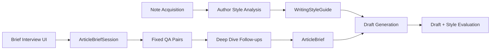

# Three-phase local article generation implementation plan

Date: 2026-05-01

This plan implements [ADR 0001](../adrs/0001-three-phase-local-article-generation.md).

## Goal

Build a local-first article generation workflow that can:

1. collect Terisuke's note.com articles and summarize stable writing tendencies,
2. interview the user one question at a time with fixed questions and targeted deep dives to create a concrete article brief,
3. generate a Note-ready draft from the style guide and brief,
4. verify the output locally with repeatable scenario tests.

The target model is `gemma4:31b` through an OpenAI-compatible local endpoint.

## Non-goals

- Do not build a fully autonomous multi-agent runtime in the first iteration.
- Do not require cloud services for normal local operation.
- Do not depend on note.com undocumented JSON APIs for the product's primary path.
- Do not attempt to guarantee publication-ready output without human review.

## Architecture

## Package Plan

### Domain

Add or extend:

- `internal/domain/author`
  - `AuthorSource`
  - `AuthorStyleProfile`
  - `WritingStyleGuide`
  - profile validation and comparison rules

- `internal/domain/brief`
  - `ArticleBriefSession`
  - `ArticleQuestion`
  - `BriefAnswer`
  - `QuestionFlowType`
  - `DeepDivePlan`
  - `ArticleBrief`
  - completion rules

- `internal/domain/article`
  - keep `Draft`
  - keep style metrics that are article-level
  - avoid Note/LLM dependencies

### Application

Add:

- `internal/application/authorstyle`
  - `AnalyzeAuthorStyleService`
  - converts fetched articles into profile and guide
  - optionally calls a local LLM to produce the natural-language style guide from objective metrics and excerpts

- `internal/application/brief`
  - `InterviewService`
  - `QuestionSelector`
  - `PhaseDetector`
  - `DeepDiveTargetSelector`
  - `DeepDiveQuestionGenerator`
  - `BriefAssembler`

- `internal/application/draft`
  - `GenerateDraftService`
  - builds the draft prompt from `WritingStyleGuide + ArticleBrief`
  - validates paste-ready Markdown
  - computes strict style comparison

### Infrastructure

Add:

- `internal/infrastructure/repository/memory`
  - in-memory repositories for sessions and style profiles
  - enough for local UI and tests

- `internal/infrastructure/repository/files`
  - optional JSON file persistence for scenario outputs and reusable profiles

Keep:

- `internal/infrastructure/note`
- `internal/infrastructure/llamacpp`

### Handlers

Add:

- `POST /api/author-style/analyze`
- `GET /api/author-style/{id}`
- `POST /api/brief-sessions`
- `GET /api/brief-sessions/{id}`
- `POST /api/brief-sessions/{id}/answers`
- `POST /api/drafts`

Keep:

- `POST /api/generate` as a compatibility endpoint until the UI is migrated.
- `GET /api/models`.

## Domain Details

### Author Style Analysis

Inputs:

- note username, usually `cor_instrument`,
- optional article limit,
- optional explicit article URLs.

Outputs:

- profile ID,
- source articles metadata,
- objective metrics:
  - sentence length,
  - paragraph length,
  - quote density,
  - first-person preference,
  - heading structure,
  - recurring keywords,
  - opening pattern,
  - conclusion pattern.
- natural-language writing guide:
  - preferred first person,
  - recurring themes,
  - rhythm and paragraph style,
  - topics to connect when relevant,
  - anti-patterns.

Acceptance criteria:

- Can fetch real note.com articles in an explicit scenario test.
- Can run a unit test with mocked article data.
- Produces a stable guide without passing full article bodies into draft generation.

### Article Brief Interview

The interview should ask one question at a time. The initial question set should be small and deterministic:

1. What is the article's core theme?
2. What concrete experience or episode should open the article?
3. Who is the reader?
4. What should the reader feel or do after reading?
5. What must be included?
6. What must be excluded?
7. What target length and structure should be used?
8. Should the article be more introspective, technical, narrative, or practical?

After these fixed questions, the system must perform targeted deep dives before completing the brief. This is based on the `polls` pattern where fixed answers are saved first and follow-up questions are tied to the original question.

Question flow types:

- `main`
  - deterministic fixed questions.
- `deep_dive_permission`
  - optional confirmation before follow-up questions.
- `deep_dive_follow_up`
  - generated follow-up question anchored to one fixed question and one user answer.
- `completed`
  - no more questions; final brief can be assembled.

Deep-dive target selection:

- Always consider these fixed answers as candidates:
  - opening episode,
  - must-include content,
  - expected reader action,
  - tone/stance.
- Prefer answers that are concrete but underexplained.
- Skip answers that are purely operational, such as target length.
- Cap follow-ups at 2 per target in the first implementation.
- Cap total follow-ups at 4 in the first implementation.

Deep-dive follow-up rules:

- Ask exactly one question at a time.
- The follow-up must reference the fixed question or the user's answer.
- Avoid yes/no questions.
- Avoid binary "A or B" questions.
- Ask for one of:
  - a specific scene,
  - the reason behind a judgment,
  - a concrete failure or turning point,
  - the emotion at the time,
  - the lesson the reader should receive.
- Store `target_question_id` and `follow_up_index` with the answer.
- If local LLM follow-up generation fails, use a safe rule-based fallback question.

Completion rules:

- theme is present,
- reader is present,
- purpose or expected reader action is present,
- must-include content is present,
- at least one high-value answer has been deep-dived unless the user explicitly skips,
- target length is present or defaulted,
- style profile ID is selected.

The service may ask follow-up questions when an answer is vague. The first implementation should use deterministic target selection and a local LLM only for phrasing the follow-up. The fallback must be rule-based.

### Draft Generation

Inputs:

- `WritingStyleGuide`,
- completed `ArticleBrief`,
- local model configuration.

Output:

- Markdown starting with `# `,
- no code fences,
- no assistant preamble,
- style comparison report.

Stricter acceptance target than the initial scenario:

- total style score: `>= 82`,
- paragraph length score: `>= 75`,
- sentence length score: `>= 75`,
- keyword overlap: `>= 70`,
- quote density: `>= 55`,
- first-person score: `>= 60`,
- candidate must use the preferred first person unless the brief explicitly overrides it.

If the score fails, the service should return the draft plus evaluation, not silently claim success.

## UI Plan

Replace the single long form with a workflow:

1. **Style**
   - username input,
   - fetch/analyze button,
   - style summary preview,
   - source article list.

2. **Interview**
   - chat-like one-question-at-a-time UI,
   - current question,
   - answer input,
   - deep-dive permission and skip controls,
   - brief summary sidebar.

3. **Draft**
   - generate button,
   - Markdown output,
   - style score and risks,
   - copy button.

The UI can remain static HTML/CSS/JS in the first implementation.

## Test Plan

### Unit Tests

- domain:
  - style guide validation,
  - brief completion rules,
  - question selection order,
  - deep-dive target selection,
  - follow-up count limits,
  - draft validation.

- application:
  - author style service with fake fetcher and fake summarizer,
  - interview service fixed-question phase transitions,
  - interview service deep-dive follow-up phase transitions,
  - draft service with fake generator and strict style comparison.

- handlers:
  - each new endpoint's request/response contract,
  - validation failures,
  - missing sessions/profiles.

### Local Scenario Tests

Add commands under `cmd/scenario`:

- `cmd/scenario/author_style`
  - fetch real Terisuke articles,
  - write `tmp/author_style/profile.json`,
  - write `tmp/author_style/guide.md`.

- `cmd/scenario/brief_interview`
  - replay a scripted Q&A,
  - include at least one deep-dive follow-up per high-value fixed answer,
  - write `tmp/brief_interview/brief.json`.

- `cmd/scenario/draft_generation`
  - read saved style guide and brief,
  - call local `gemma4:31b`,
  - write draft and comparison report.

- `cmd/scenario/full_workflow`
  - run all three phases end to end.

Scenario tests should be skipped by normal `go test ./...` unless explicit environment variables are set.

Required explicit variables:

- `RUN_NOTE_SCENARIO=1`
- `RUN_LOCAL_LLM_SCENARIO=1`
- `LLAMACPP_BASE_URL`
- `LLAMACPP_MODEL=gemma4:31b`

## Implementation Milestones

### Milestone 1: Domain and Contracts

- Add `author` and `brief` domain packages.
- Move reusable style metrics into the correct domain boundary.
- Add repository interfaces.
- Add unit tests.

Exit criteria:

- `go test ./...` passes.
- No HTTP handler depends directly on concrete Note or LLM clients for new flows.

### Milestone 2: Author Style Analysis

- Implement author style service.
- Add in-memory repository.
- Add `POST /api/author-style/analyze` and `GET /api/author-style/{id}`.
- Add scenario command that fetches real Terisuke articles.

Exit criteria:

- Real Note scenario produces `profile.json` and `guide.md`.
- Unit tests cover mocked fetch and guide generation.

### Milestone 3: Brief Interview

- Implement brief session aggregate.
- Implement deterministic question selector and phase detector.
- Implement deep-dive target selector.
- Implement follow-up question generator with safe fallback.
- Add session endpoints.
- Add static UI for one-question-at-a-time flow.

Exit criteria:

- Scripted Q&A produces a complete `ArticleBrief`.
- Scripted Q&A includes fixed questions followed by targeted deep dives.
- Deep-dive answers appear in the assembled brief.
- UI can complete a session locally without LLM calls.

### Milestone 4: Draft Generation

- Implement draft generation service.
- Use `WritingStyleGuide + ArticleBrief`, not raw articles.
- Add strict evaluation and failure reporting.
- Add `POST /api/drafts`.

Exit criteria:

- Draft scenario passes the stricter style thresholds or returns a clear failed evaluation.
- Generated draft remains paste-ready Markdown.

### Milestone 5: Compatibility and Cleanup

- Rebuild `POST /api/generate` as a compatibility facade over the three phases, or mark it legacy.
- Update README and requirements.
- Remove stale analyzer service if replaced.

Exit criteria:

- All tests pass.
- Full local workflow works from the UI.

## Risks

- Local `gemma4:31b` latency may remain high.
  - Mitigation: keep prompts short, cache style guide, avoid full article bodies during draft generation.

- note.com JSON APIs may change or become inaccessible.
  - Mitigation: product path keeps public page/RSS first; JSON API scenarios are explicit and user-initiated.

- Style metrics can overfit surface signals.
  - Mitigation: combine objective metrics with editable style guide and human review.

- UI state can become inconsistent.
  - Mitigation: make the server own brief session state and return the next expected question.

## Immediate Next Implementation Step

Start Milestone 1:

1. add `internal/domain/author`,
2. add `internal/domain/brief`,
3. define repository and gateway interfaces,
4. add unit tests for profile validation and brief completion.
